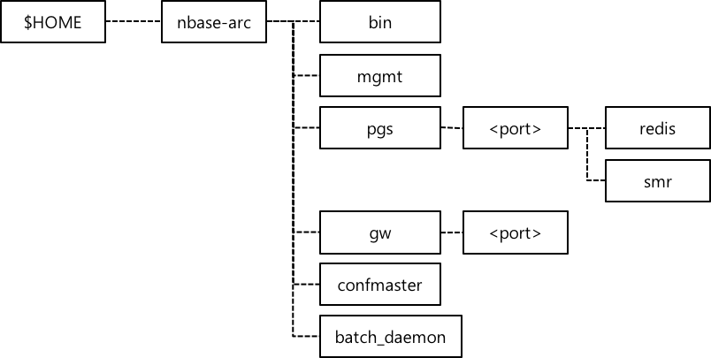
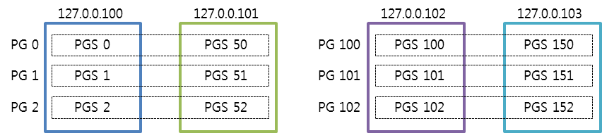

# Setup Guide
* [Preparation Before Setup](#preparation-before-setup)
  * [Check Package](#check-package)
  * [Server Environment Setup](#server-environment-setup)
* [Build a Zone](#build-a-zone)
  * [Install Management Process](#install-management-process)
  * [Install Administrative Script](#install-administrative-script)
  * [Install Batch Daemon](#install-batch-daemon)
* [Create a Cluster](#create-a-cluster)

# Preparation Before Setup
### Check Package
The nbase-arc installation package is provided in the form of a tarball.
The package contains all of the nbase-arc binary components. Install this package on the management node only.
You do not have to install this package on the data node, because the administrative script 
automatically copies the required components to the data node once an nbase-arc zone is created.

### Server Environment Setup
You should set up the server environment before setting up the nbase-arc management node and data node. 
You should set up the management node only once at first time, while you set up the data node every time 
you add a new machine.

##### Register Environment Variables  
Register $NBASE_ARC_HOME as an environment variable of the account, and add $NBASE_ARC_HOME/bin directory to $PATH. 
Register the following to .bash_profile.
```
export NBASE_ARC_HOME=$HOME/nbase-arc
export PATH=$NBASE_ARC_HOME/bin:$PATH
```

##### SSH Setting  
Some commands of nbase-arc zone are executed through Secure Shell (SSH), 
so the nbase-arc management node should be able to access the data node through SSH. 
Register the ssh public key of management node to the authorized_keys of data node 
to allow the management node to access the data node.
The SSH settings described above should be performed for all management nodes to all data nodes. 
Usually there are 3 management nodes, so the public keys of these 3 nodes should be registered 
in the authorized_keys of all data node.
(https://help.ubuntu.com/community/SSH/OpenSSH/Keys)

##### Install Package  
Copy the nbase-arc installation package to the management node, and unzip it. 
If there are 3 management nodes, you should unzip the installation package in each of 3 machines. 
Unzip the package in $HOME directory, and the installation files are decompressed into $HOME/nbase-arc directory. 

```
$ cd $HOME
$ tar xvf nbase-arc.tgz
```

### Directory Structure  
The following figure shows the directory structure of the installation files unzipped from the package. 
This is the basic directory structure of nbase-arc, which is applied to both the management and the data nodes.

In the directory structure, the \<port\> under the pgs directory is used to distinguish multiple Redis and SMR
processes installed in each machine, by port. The \<port\> directories and their subdirectories are not initially 
included in the package but created automatically when a cluster is created.
Similarly, the \<port\> under the gw directory means the gateway's port, and is also created automatically 
when a cluster is created.

|Directory|Description|
|---------|-----------|
|bin|binary|
|mgmt|Administrative script|
|pgs|	A working directory of processes that compose a PGS. (1 PGS = 1 REDIS + 1 SMR)|
|pgs/\<port\>/redis|	A directory where the redis-arc process is executed.  The redis configuration file (redis.conf) and periodic backup file (rdb file) are saved in this directory.|
|pgs/\<port\>/smr|	A directory where the smr-replicator process is executed.  The smr's replica logs are saved in this directory.|
|gw/\<port\>|	A working directory of the gateway process.  confmaster	A working directory of the Configuration Master process.  The JAR files and configuration files to run Configuration Master are saved in this directory.|
|batch_daemon|	Performs the back task like Cluster Dump.|

# Build a Zone
If you have already built a Zone, skip this section and go to [Create a Cluster](#create-a-cluster)
The procedures described in [Install Management Process](#install-management-process),
[Install Administrative Script](#install-administrative-script) should be performed for all the management nodes. 
If you have three nbase-arc management nodes, 
you should install the management process and administrative script in all of the three machines.

## Install Management Process
### Install ZooKeeper
* Install Java 1.6 or 1.7
* ZooKeeper Ensemble Configuration  
  Please refer to the following URL and install ZooKeeper. It is recommended to use at least 3 ZooKeeper instances that compose an ensemble, for availability. http://zookeeper.apache.org/doc/r3.4.5/zookeeperStarted.html

### Install Configuration Master
Access each and every management node, change the configuration of confmaster and execute it.  
Edit the cc.properties file in `$NBASE_ARC_HOME/confmaster` directory, as follows.  
```
confmaster.ip=<IP address of the management node>
confmaster.port=<Client listen port of confmaster>
confmaster.zookeeper.address=<Zookeeper ensemble address>
```

Enter the ZooKeeper ensemble address in the form of connection string, as shown below. The connection string format is "IP:port,IP:port,IP:port" where the IP is the IP address of each management node in which ZooKeeper is run, and the port is the basic port of ZooKeeper, 2181.  
```
confmaster.zookeeper.address=xxx.xxx.xxx.xxx:2181,xxx.xxx.xxx.xxx:2181,xxx.xxx.xxx.xxx:2181
```

Enter the IP address of the machine (management node) currently connected, for confmaster.ip  
```
confmaster.ip=xxx.xxx.xxx.xxx
```

Use the default settings for the following fields of cc.properties.  
```
confmaster.port=1122
```

Use the following command to execute confmaster.  
```
$ ./confmaster.sh
```

When you execute confmaster, the nbase-arc management process is started. Run the process on every management node.

### Install Administrative Script
The administrative script is used to create and delete a cluster, replace machines, perform migration and others. You should install the administrative script on each and every management node, to build an nbase-arc zone. All the scripts have already been copied to the machine when you unzip the installation package, so you just need to follow the procedure described in this section to configure the administrative script.
##### Install Python and Required Libraries
* python 2.7 (http://www.python.org/)
* pip (http://www.pip-installer.org/en/latest/installing.html)
* Fabric 1.8+ (http://docs.fabfile.org/)

##### Set Up Environment for Administrative Script  
The administrative script is in `$NBASE_ARC_HOME/mgmt` directory, if the package has been installed in the management node. Open the `$NBASE_ARC_HOME/mgmt/config.py` file to edit the configuration information.

```
CONF_MASTER_IP = <IP address of the management node>
CONF_MASTER_PORT = <Client listen port of confmaster>

NBASE_ARC_VERSION = <Version of nbase-arc>
NBASE_GW_VERSION = <Version of nbase-arc>
SMR_VERSION = <Version of nbase-arc>

USERNAME = <Account name of nbase-arc>
```

You should edit the values in the code above.  
* CONF_MASTER_IP  
  Enter the IP address of one of the nbase-arc management nodes.
* NBASE_ARC_VERSION, NBASE_GW_VERSION, SMR_VERSION  
  Enter the version of nbase-arc to install.
* USERNAME  
  Enter the account name for which nbase-arc is installed. As described in [Preparation Before Setup](#preparation-before-setup) the management node and the data node should use the same account name.
When the configuration of administrative script is completed, run the script and execute commands to operate nbase-arc. How to execute these commands will be covered later in this document.

### Install Batch Daemon
A batch daemon is an optional component that periodically processes batch jobs registered in the Configuration Master, such as cluster backup and cluster dump which provides cluster data to users. You can skip installing batch daemon if you don't need periodic backup of a cluster. Please refer to [Batch Job Configuration](ClusterDump.md#batch-job-configuration) for how to register jobs in the Configuration Master.

##### Batch Daemon Configuration
You can check the configuration in `batch_daemon` directory of the package. Open `the nbase-arc/batch_daemon/config.py` file and set the value of CONF_MASTER_IP as the actual IP address of Configuration Master. Use the default settings for others. 
```
CONF_MASTER_IP = <IP address of the management node>
CONF_MASTER_PORT = <Client listen port of confmaster>

USERNAME = <Account name of nbase-arc>
```

##### Run Batch Daemon
Execute the following to run the batch daemon.
```
batch_daemon.py &>/dev/null &
```
While the batch daemon is running, the result is saved in the `nbase-arc/batch_daemon/job/[cluster name]` directory. Please refer to [Batch Job Configuration](ClusterDump.md#batch-job-configuration) for how to register jobs in the batch daemon.

# Create a Cluster
Create a cluster with the administrative script, which is located in the `$NBASE_ARC_HOME/mgmt` directory of the management node. Access the management node and run the script with the following command.
```
$ cd $NBASE_ARC_HOME/mgmt
$ fab main
```
When the following description is shown, select "Install Cluster" to install a cluster.

<pre>
=======================================
1. Show cluster information
2. Upgrade PGS
3. Upgrade GW
4. Install Cluster
5. Install PGS
6. Install GW
7. Uninstall Cluster
8. Uninstall PGS
9. Uninstall GW
10. Add replication
11. Leave replication
12. Migration
13. Repair Cluster (Cluster already installed)
14. Deploy bash_profile
x. Exit
=======================================
>> 4
Cluster name :  <b>your_cluster</b>
PG count :  <b>8</b>
Replication number :  <b>2</b>
PGS Physical Machine list([["PM_NAME PM_IP", "PM_NAME PM_IP"], ["PM_NAME PM_IP", "PM_NAME PM_IP"], ...]) <b>[["machine1 xxx.xxx.xxx.xxx", "machine2 xxx.xxx.xxx.xxx"], ["machine3 xxx.xxx.xxx.xxx", "machine4 xxx.xxx.xxx.xxx"]]</b>
Gateway Physical Machine list([PM_NAME PM_IP, PM_NAME PM_IP, ...]) <b>["machine1 xxx.xxx.xxx.xxx", "machine2 xxx.xxx.xxx.xxx", "machine3 xxx.xxx.xxx.xxx", "machine4 xxx.xxx.xxx.xxx"]</b>
</pre>

### Parameters
The parameters required to create a cluster is listed below. Enter these parameters and the script to create a cluster is run.

##### Cluster name
A name of cluster to create

##### PG count
The number of partition groups. It usually depends on the overall memory capacity and number of CPU core of the machines that you deploy the cluster. 

##### Replication number
The number of replicas. The value is 2 in general.

##### PGS Physical Machine list
The list of PGS installed machines. Enter the value in the following form.

```
[[“<hostname 1> <IP 1>”, “<hostname 2> <IP 2>”], [“<hostname 3> <IP 3>”, “<hostname 4> <IP 4>”]]
```

You should enter the IP addresses of all data nodes to install PGS in all the data nodes of the cluster. PGS is replicated as many times as the replication number above and stored for availability, because the actual data is stored in it. Therefore, when you enter the list, you should specify the replication relations between the machines. 

The input form of the list contains two pairs of square brackets, where the machines enclosed in the inner square brackets have the same data(replication). If the replication number is 2, put the two machines in the inner square brackets and then enclose them in the outer square brackets.  

In the following example, host 1 and host 2 have the same data, and host 3 and host 4 have the same data.
```
[[“<hostname 1> <IP 1>”, “<hostname 2> <IP 2>”], [“<hostname 3> <IP 3>”, “<hostname 4> <IP 4>”]]
```

##### Gateway Physical Machine list 
List of gateway physical machines. Enter the value in the following form.

```
[“<hostname 1> <IP 1>”, “<hostname 2> <IP 2>”, “<hostname 3> <IP 3>”, …]
```

Install gateways in all data nodes in the cluster. For example, if you have installed a cluster in two data nodes, enter the IP addresses of the two nodes in the form above to install gateways on each one. 

##### Example
The following shows a list of input parameters and the configuration of cluster that is created as a result.

*	Cluster name: your_cluster
*	PG count: 6
*	Replication number: 2
*	PGS Physical Machine list: `[["machine1 127.0.0.100", "machine2 127.0.0.101"], ["machine3 127.0.0.102", "machine4 127.0.0.103"]]`
*	Gateway Physical Machine list: `["machine1 127.0.0.100", "machine2 127.0.0.101", "machine3 127.0.0.102", "machine4 127.0.0.103"]`


